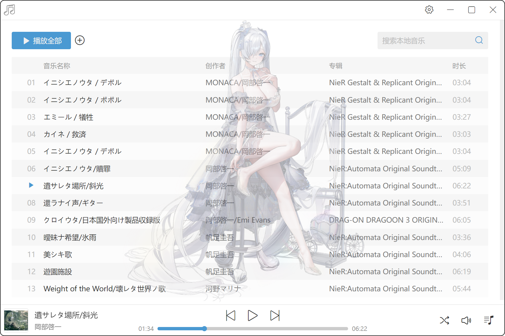

# Muum本地音乐播放器

## 介绍

基于Electron制作的本地音乐播放器，相关功能：
* 本地音频文件导入，音乐添加到播放列表
* 音乐的播放、暂停、上一曲、下一曲、播放模式切换、音量调节
* 音乐进度条点击、拖拽控制进度，音量进度条点击、拖拽控制大小
* 上下文菜单查看音乐本地路径、删除音乐文件
* 资源管理器中手动删除、修改本地音乐文件，实时更新播放器中音乐文件列表
* 支持根据音乐名称、创作者、专辑进行音乐文件过滤搜索
* 背景使用`Spine Web Player`生成的live2D人物，live2D动画和音乐播放、暂停存在联动
* 支持主题切换，切换后live2D人物和主题色会变更

## 技术栈

* `Electron`框架用于本地应用的搭建，`electron-store`用于用户本地数据的存储
* `Node.js`读取、修改本地文件
* `Chokidar`三方库监控本地文件目录
* `React`框架开发渲染层的UI界面和相关逻辑
* `music-metadata`三方库用于解析获取到的音频文件
* `@szhsin/react-menu`三方库用于上下文菜单制作
* `fuse.js`三方库用于音乐文件的模糊搜索
* `Spine Web Player`用于背景live2D人物的制作

## 效果展示

**主页**

**上下文菜单**

**搜索**

**播放列表**

**设置**

**主题切换**

**Live2D动画效果**

## 技术要点

**Electron主进程和渲染层间的通信**
`Electron`编程和常规web开发不同的地方在于，我们可以调用`Electron`提供的API来获取和修改本地应用的状态，例如关闭、最大化、最小化应用这些，或是通过`Node`访问和修改本地文件，例如读取和修改音频文件，而这些操作都在主进程中进行，也就是`Electron`提供的`main.js`文件中，而触发这些操作的地方却往往发生在渲染层，也就是我们开发的web页面上，这时就需要进行主进程和渲染层间的通信。

主进程和渲染层间的通信，本质上就是`Electron`提供的`ipcMain`和`ipcRenderer`两个接口互相发送消息，`ipcMain`用于主进程，`ipcRenderer`用于渲染层，值得注意的是`Electron`官方并不推荐把`ipcRenderer`相关代码直接写在渲染层的代码中（默认无法访问），而是通过`preload`参数指定一个预加载脚本，在这个脚本里写`ipcRenderer`的相关逻辑，渲染进程再通过预加载脚本暴露出来的API来发送和接受消息，通过这种方式个人觉得一来可以统一的管理`ipcRenderer`的相关接口，避免代码混乱；二来通过禁止在渲染层代码中直接去调用`Node.js`，增强安全性，避免诸如`XSS`等一些攻击。

**导入音乐的逻辑处理**
音乐播放器提供导入音乐的功能，本质上是复制音频文件到播放器的歌曲路径下，如果存在同名文件，会提示是否覆盖。

**本地文件路径的监控**
音乐播放器希望实现播放器的歌曲路径下歌曲文件发送变动时，能够实时的感知到变化，同时将变化反映到播放器上，`Node`自带对于文件路径的监控，但是功能不够完善，同时兼容性较差，这里使用`Chokidar`三方库对歌曲路径进行监控，感知文件变化。

开发过程中遇到一个问题，如果用户手动修改歌曲路径文件夹本身或者更上层目录，让歌曲路径不再存在`Chokidar`会感知不到，从而导致路径错误，造成不小的问题，针对这个问题我尝试了多个其他三方库，问题同样存在，也考虑使用`Node`让歌曲路径文件夹在应用运行始终被占用，无法被修改，但是使用网上的方法，一直无法实现，文件依然能被修改，最终，采用的是比较朴实的方法，额外启用一个定时器，每隔一段时间判断歌曲路径是否存在，如果不再存在，执行后续相关操作。

**文件列表、播放列表的单选和多选操作逻辑**
单向只需要把点击的元素设置为选中状态，而多选的逻辑为：按下ctrl加点击，如果元素为已经选中的状态，则取消选中状态，如果元素为未选中状态，则额外添加这个元素为选中状态；按下shift加点击，则把上一个选中的元素到当前点击的元素之间的元素都设置为选中状态。

具体开发就是要判断用户是否按下了ctrl、shift以及记录相关的`index`从而完成多选的逻辑，值得注意的是文件列表、播放列表两个组件都使用了同一套单选和多选的逻辑，所有这里单独把这块逻辑抽成一个`useSelectList`的hook，从而避免重复代码的编写。

**进度条拖动和点击的处理**
点击只需要获取鼠标点击的位置，移动进度条，调整音频播放进度就可以，而拖动则需要我们在确认用户要开始拖动操作后，开始监听`mousemove`和`mouseup`事件，用来实时调整进度条位置和判断用户何时松开鼠标。

**live2D动画效果的制作**
live2D动画使用`Spine Web Player`制作，美术资源来源于[Nikke-db.github.io](https://github.com/Nikke-db/Nikke-db.github.io)，通过创建`SpinePlayer`对象，指定live2D相关资源，以及相关动画参数，通过`animationState`控制动画的变化，和音乐的播放和暂停，使用`dispose`销毁和重建live2D来完成不同主题的切换。

在引入2B的live2D时，出现了在切换动画时，人物出现放大缩小的异常问题，调试后发现是初始化`SpinePlayer`对象的`defaultMix`属性的问题，按照官网上的描述，`defaultMix`用来控制两个动画之间切换时，平滑过渡的时长，默认值0.25秒，当我们把`defaultMix`设置为0时，2B的live2D大小缩放的问题得到了解决，且动画效果没有问题，推断两个动画默认人物大小本身不一致，我们可以通过属性去修改动画默认人物大小，但是如果采用了默认的`defaultMix`，会存在一个过渡的过程，从而导致人物放大和缩小。
