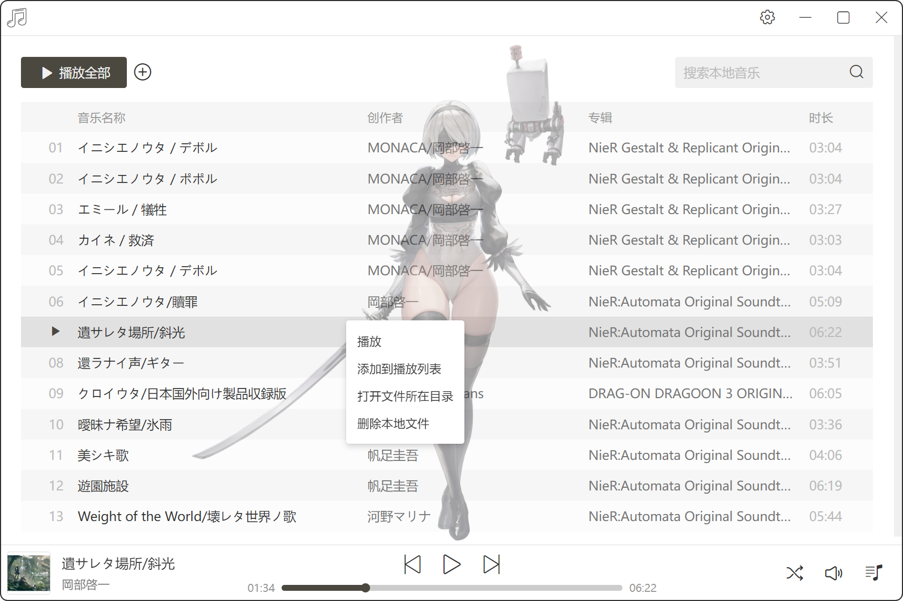
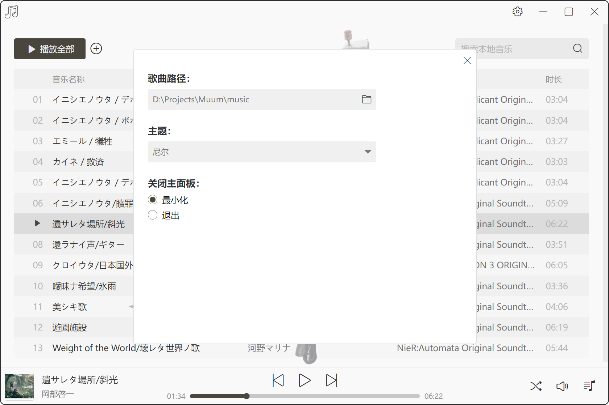

## 基于Electron开发的本地音乐播放器

#### 实现的功能：
1. 本地歌曲导入
2. 歌曲路径选择
3. 本地歌曲搜索
4. 歌曲播放、暂停、上一曲、下一曲
5. 歌曲模式选择
6. 歌曲音量调节
7. 播放列表显示
8. 歌曲本地路径查看、删除
9. Live2D的实现和联动

#### 功能展示：

**整体页面：**

**播放列表：**

**搜索功能：**

**上下文菜单：**

**设置：**

**主题切换：**

**Live2D效果：**

#### 开发中遇到的问题和总结：
1. 上下文菜单的实现
2. 顶部菜单的实现
3. 歌曲的读取和解析
4. 歌曲本地路径的变化与界面展示的歌曲实时更新
5. Live2D的实现
6. Electron中Main和渲染层之间的通信
7. 查询功能的实现

**1.上下文菜单的实现**
最初的想法是使用Electron原生的API来实现，但是发现原生右键菜单的样式无法很好的自定义，无法与应用本身的样式主题适配，故而采用的是浏览器端来实现的方式，即浏览器端实现类似上下文菜单的效果，最终触发给主进程，这方面已有不少比较成熟的库，我使用的是`@szhsin/react-menu`这个库。

**2.顶部菜单的实现**
和上下文菜单同理，为了追求样式主题的统一和更多的自定义空间，同样是在浏览器端实现的顶部菜单，通过`menuBarVisible`设置为false，来隐藏原生的顶部菜单。

**3.歌曲的读取和解析**
对于音频文件，需要解析的信息大致有歌名、歌手、专辑、封面、时长，可以放在主进程也可以放在渲染层来解析，由于是批量处理的工作，且在应用打开时，就需要用到相关的歌曲信息，最后考虑是放在主进程通过node来处理，使用的是`music-metadata`这个库，因为浏览器的`audio`标签只需要提供歌曲路径就能播放歌曲，故在解析最后还需要有歌曲的本地路径，值得一提的是封面的处理，因为封面的信息大小相比其他信息要大很多，如果歌曲较多时，会占用比较高的内存，所有在解析时会跳过封面，当播放器切换到对应歌曲时，再通知主进程解析对应歌曲的封面信息，回传到渲染层。

**5.Live2D的实现**
播放器背景的Live2D使用的是Nikke的Live2D美术资源，结合Spine所实现，在实现的过程中，对于2B动画切换遇到了一点小问题，2B在动画切换时，会出现大小的异常变化，且切换动画明显能感觉到延迟，而测试其他Nikke角色动画却没有这个问题，最后结合官方文档，发现是`defaultMix`这个参数的问题，它表示两个动画切换时平衡过渡的实现，默认值为`0.25`秒，当我们把`defaultMix`设置为`0`时，2B动画切换就没有什么问题了，延迟也消失了，而其他Nikke角色如果`defaultMix`设置为`0`，可以明显感觉到动画切换有些生硬，其中的差异我猜测可能是Live2D的skel和atlas文件不同所导致的。

**6.Electron主进程和渲染层之间的通信**
Electron主进程可以调用Node进行本地文件资源的处理以及Electron原生事件的触发等等，而渲染层界面逻辑的交互，当主进程需要主动触发渲染层的一些事件，或者渲染层需要做一下主进程才能实现的功能时，就涉及到两者的通信，当然可以通过一下API实现在渲染层直接些主进程的逻辑，但是这样不符合Electron官方的设计理念，Electron推荐的是使用preload作为桥梁沟通主进程和渲染进程，具体来说就是`ipcRenderer`这个用于和主进程沟通的API相关逻辑，集中写在`preload.js`这个文件中，Node相关操作、Electron相关事件逻辑依然写在主进程的文件中，渲染层在需要触发主进程或者监听主进程事件触发，都通过preload挂载在全局对象`window`上的一个自定义对象来触发，这样所有主进程和渲染层交互的接口都统一集中在preload下，统一进行管理，刚开始使用preload时，感觉很麻烦，不如直接在渲染层中写，当交互逻辑变多了之后，才发现这样设计的精妙所在。

**7.查询功能的实现**
使用`Fuze.js`三方库对音乐名称、创作者、专辑进行模糊搜索，值得注意的是要使用`threshold`参数来控制模糊匹配的严格程度，获取搜索到的结果后，对显示的列表数据进行筛选，并对符合的字符串做高亮显示。
